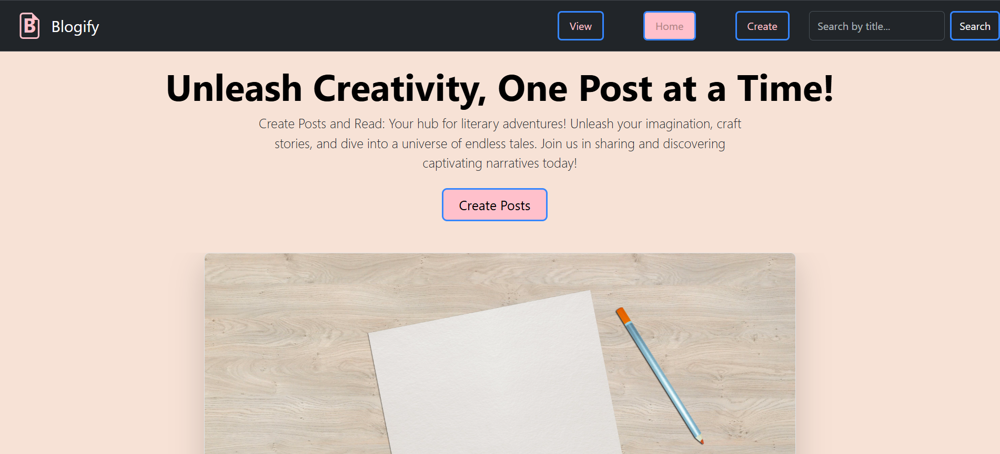

## 📖 Blogify – A Simple Blog Website
---


**Blogify** is a minimalist blogging platform built using **Node.js**, **Express.js**, and **EJS** templating. It allows users to create, view, and read blog posts in a clean and responsive interface.

---

## 🚀 Features

- 📝 Create, Read, View blog posts
- 🎨 Clean and responsive UI with custom CSS
- 🧩 Modular EJS templates for reusability
- 🖼️ Public assets for images and styles
- 📁 Simple and beginner-friendly project structure

---

## 🛠️ Tech Stack

- **Backend:** Node.js, Express.js
- **Templating:** EJS (Embedded JavaScript)
- **Styling:** CSS (main.css, style.css)
- **View Engine:** EJS with partials (`header`, `footer`)
- **Folder Structure:** MVC-like with clean separation

---
## 📁 Folder Structur

```bash
Blogify/
├── node_modules/               # Installed dependencies
├── public/                     # Static files
│   ├── images/                 # Images used in UI
│   │   ├── hero.jpg
│   │   └── wave.png
│   └── styles/                 # Custom CSS styles
│       ├── main.css
│       └── style.css
│
├── views/                      # EJS templates
│   ├── partials/               # Reusable layout components
│   │   ├── footer.ejs
│   │   └── header.ejs
│   ├── create.ejs              # Create post page
│   ├── index.ejs               # Home page
│   └── view.ejs                # Single blog post view
│
├── index.js                    # Entry point (Express server)
├── package.json                # Project metadata & dependencies
├── package-lock.json           # Dependency lock file
├── screenshot-1.png            # UI Screenshot
├── screenshot-2.png
└── screenshot-3.png

```

---


